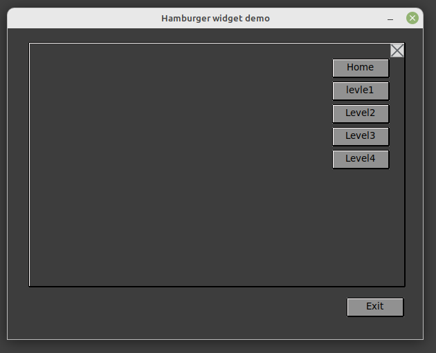

# HowTo

---

APPLICATION INFORMATION AT STARTUP in the Terminal:

Runing time now: 2023-8-24
 Program name: hamburger widget demo
 Version: 0.0.2
 © Copyright: Halvard Tislavoll, 2023
 Lisence: MIT
 Operating System: Linux
 System Running: Python version.3.8.10
 inkl. module: Pillow ver. 9.0.1
 Program location: /home/halvard/POC/hamburger_widget_demo_support.py

---

## Initial Thought

Create a class that;

- takes a frame as parent and as
  
- add a hamburger menu as again
  
- controls the current layer/frame as a stack
  
- appears at the top of the stack as
  
- a tab in a notebook
  


## Development Start-up

As usual when I program something from scratch, carry out concept development, I start PAGE to implement my initial thoughts.

```python
# Support module generated by PAGE version 7.6
#  in conjunction with Tcl version 8.6
#    Aug 23, 2023 09:52:22 AM CEST  platform: Linux
```

## Script fragment

Central to this concept was inventing a class that can exercise a context menu buttons control. Here is the class:

```python
class Hamburgermenu:
 """To achieve toggling between two GIFs on a label within a canvas-based window"""
 def __init__(self, parent_frame, window_x, window_y, window_width, window_height, gif_paths, tooltip_text):
 # set actual frame
 self.frame = ttk.Frame(parent_frame)
 self.frame.pack(anchor='ne')
 self.text=tooltip_text
 # make a canvas to display the gif
 self.canvas = tk.Canvas(self.frame, width=window_width, height=window_height)
 self.canvas.pack()
 # make a window on canvas to hold a label for the gif
 self.window = self.canvas.create_window(window_x, window_y, width=window_width, height=window_height)
 self.label = tk.Label(self.canvas)
 hamburger_widget_demo.ToolTip(self.label, self.text)
 self.label.pack()
 # load the gif
 self.gif_paths = gif_paths
 self.current_gif_index = 0
 self.load_gif(self.gif_paths[self.current_gif_index])
 # bind the mousebutton event
 self.label.bind("<Button-1>", self.toggle_gif) # Bind left mouse button click eventdef load_gif(self, gif_path):
    """make a gif instance and put it on label"""
    img = tk.PhotoImage(file=gif_path)
    self.label.config(image=img)
    self.label.image = img  # Keep a reference to prevent the image from being garbage collected

def toggle_gif(self, event):
    """toggle gif instance on label"""
    self.current_gif_index = (self.current_gif_index + 1) % len(self.gif_paths)
    if self.current_gif_index == 0:
        hide_widget(_w1.TfrmMenu)   # menu frame
        if shared.frame:
            shared.frame.destroy()
    else:
         show_widget(_w1.TfrmMenu)   # menu frame
    self.load_gif(self.gif_paths[self.current_gif_index])`
```
